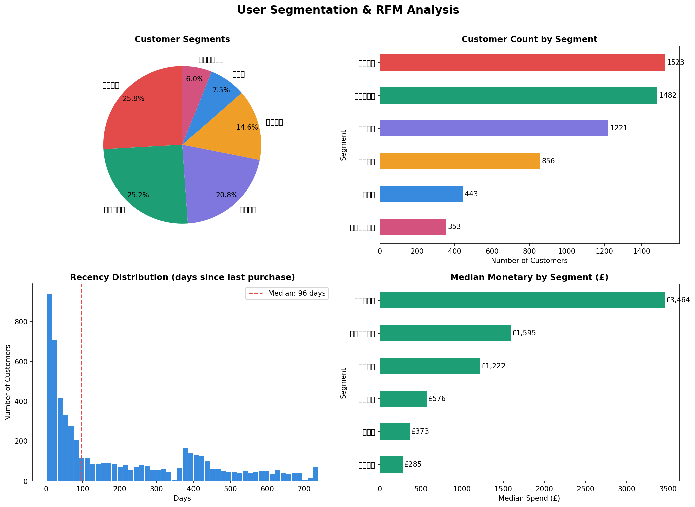
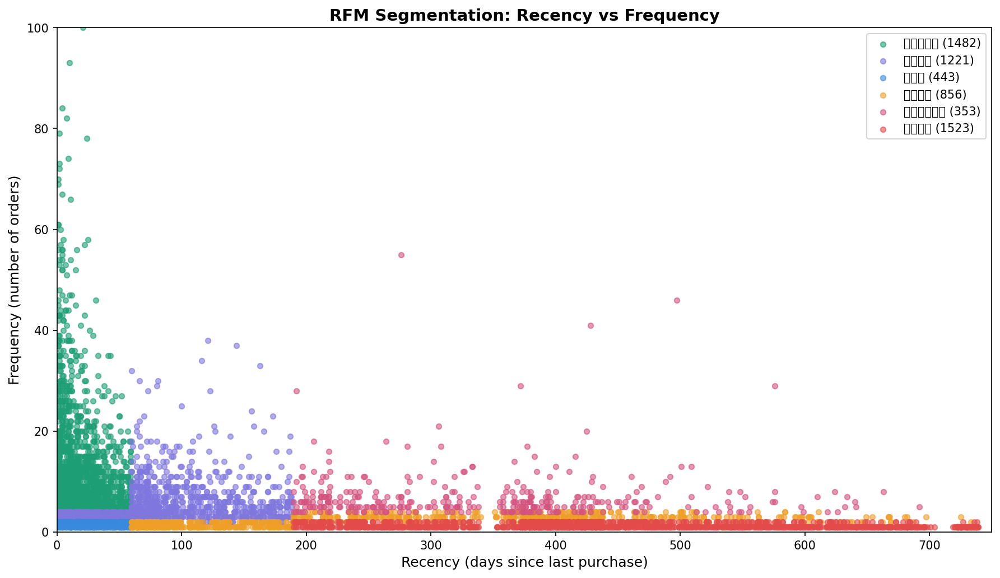

# Online Retail - RFM User Segmentation Analysis

## 项目简介
基于 Online Retail II 真实电商数据集（100万+条交易记录），完成端到端数据分析流程，
通过 RFM 模型对 5,878 名客户进行分层，识别高价值用户并提出差异化运营策略。

## 数据集
- 来源：[Online Retail II - Kaggle](https://www.kaggle.com/datasets/mashlyn/online-retail-ii-uci)
- 规模：1,067,371 条原始记录，清洗后保留 805,549 条（75.5%）
- 时间跨度：2009-12-01 至 2011-12-09

## 技术栈
| 工具 | 用途 |
|------|------|
| pandas | 数据清洗与处理 |
| NumPy | 数值计算 |
| matplotlib | 图表绘制 |
| seaborn | 统计可视化 |

## 分析流程
1. **数据加载** — 读取 CSV，合并字段，了解数据结构
2. **数据清洗** — 处理缺失值（24.5%）、过滤退货单、去除异常值
3. **特征工程** — 新增 TotalPrice 字段，转换日期格式
4. **RFM建模** — 计算每位客户的 Recency / Frequency / Monetary 三维度得分
5. **用户分层** — 按 R/F 分数划分6个用户群体
6. **可视化** — 分层饼图、柱状图、散点图、Recency分布图

## 用户分层结果
| 用户群体 | 数量 | 占比 | 中位消费 |
|---------|------|------|---------|
| 高价值客户 | 1,482 | 25.2% | £3,464 |
| 流失客户 | 1,523 | 25.9% | £285 |
| 潜力客户 | 1,221 | 20.8% | £1,222 |
| 一般客户 | 856 | 14.6% | — |
| 新客户 | 443 | 7.5% | — |
| 流失高频客户 | 353 | 6.0% | — |

## 核心结论
- 高价值客户（25.2%）中位消费 **£3,464**，距上次购买仅 17 天，是核心留存对象
- 流失客户（25.9%）距上次购买已超 **435 天**，需启动 Win-back 召回活动
- 潜力客户（20.8%）具备成长空间，适合交叉销售与升级引导策略

## 可视化结果

### RFM 分析总览

### 用户分层散点图（Recency vs Frequency）

## 项目结构
